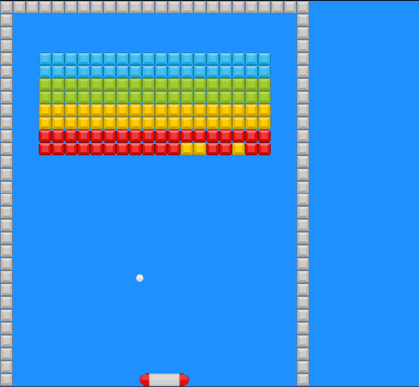

# BreakOut Clone in C++

This is a clone of the classic game BreakOut. It is written using the [oLcPixel
GameEngine](https://github.com/OneLoneCoder/olcPixelGameEngine), which is a
great minimal game engine that provides just enough routines to draw graphics
on the screen and receive user's input/output.  Assets are by
[Kenney](https://www.kenney.nl/).

This project is under active development. It is made for learning purposes, so I
will add more comments as a I go. Hopefully, it will be helpful to someone in
the future. Please let me know if you found any mistake or bug in the code. 

Cheers!

## ScreenShot:

## To build:
cmake -S . -B Build
cd Build
make

## To run (Linux):
./BreakoutClone

